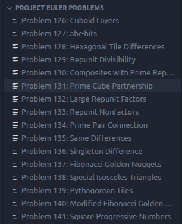
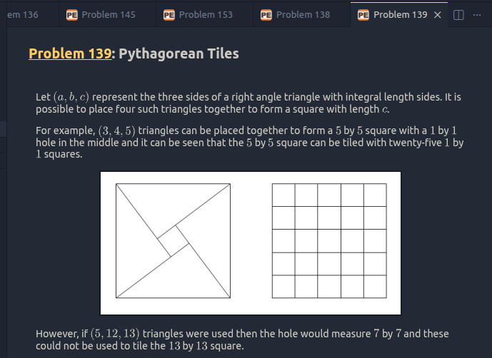
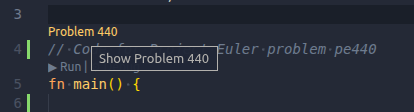
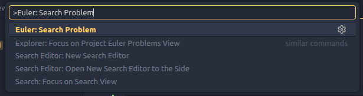
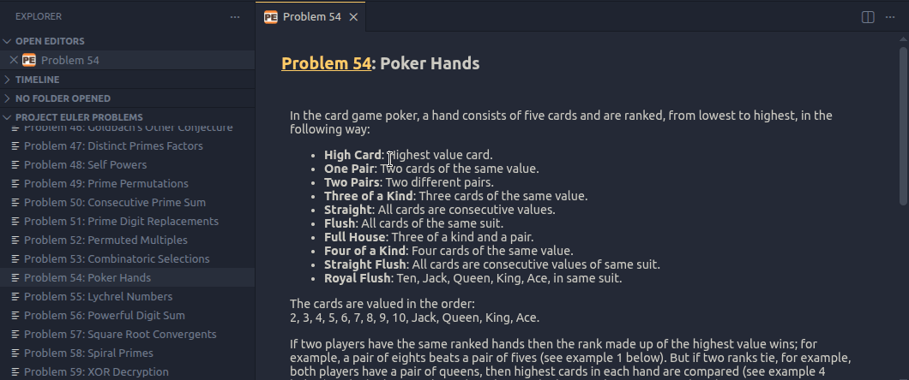

# Project Euler

VSCode Extension that allows viewing Project Euler problems from your editor

## Features

A tree view panel in the Explorer view showing all current published problems. Clicking on an item will open that problem in a new tab.

A Webview for displaying Project Euler problems. All images and math equations are rendered properly. However there is currently no way to submit answers.

CodeLenses that allow links to open the webviews from comments or code in your editor.

Command palette search to search for and display problems by their problem number.

Text files associated with problems can be opened in a new editor and saved or viewed from there.

## Requirements

VSCode 1.109.0 or higher

## Extension Settings

This extension contributes the following settings:

* `projecteuler.enableCodeLens`: Enable/disable CodeLens links to problems (matching 'pe=###', 'problem=###' or 'problem = ###').
